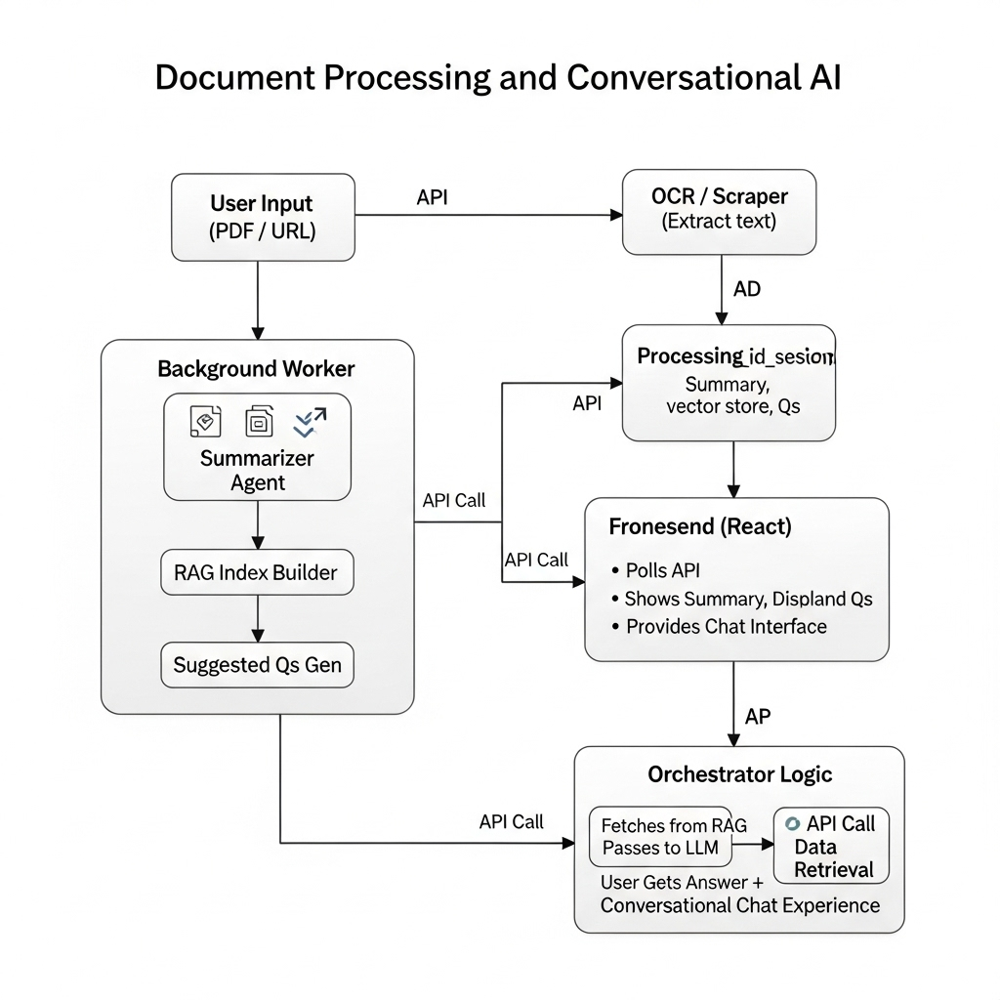

DocLens
Project Moto:
Upload any document, get its essence in minutes, and then have a natural conversation with it.
Project Fuctionalities:

     Look into your doc → The system extracts text from PDFs or websites and structures it for AI.

     Grab the summary → You instantly receive a clear, concise summary, so you don’t have to read hundreds of pages.

     Ask anything → Through an interactive chat, you can query details, clarify points, or explore deeper insights, with suggested questions guiding you.

     Always accessible → Instead of just static summaries, it’s like having a smart assistant who has read the entire document for you and is ready to answer follow-ups on demand.
How it Works?
    Important Modules:
       OCR (Optical Character Recognition)
        Like Google Lens for your PDFs — it can read text even from scanned documents or images. 
        Example: Upload a scanned offer letter → OCR extracts the text so AI can process it.

        RAG (Retrieval-Augmented Generation)
         Think of it like ChatGPT with “deep search” turned on. Instead of guessing, it searches your document chunks and answers based only on that.  RAG fetches the exact table and gives the grounded answer.

        Orchestrator
        Acts like the if-else logic of your system. It decides:
        If OCR is needed (scanned doc vs. text doc),When to build the RAG index,When to switch into chat mode.
        Basically, it’s the project manager making sure each module runs at the right time.
    The Actual Workflow:
    

